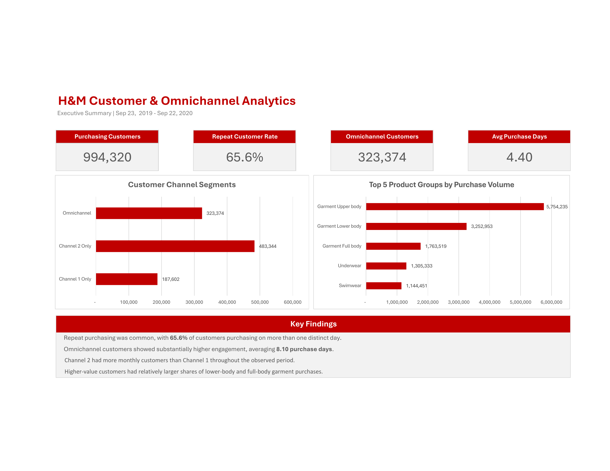
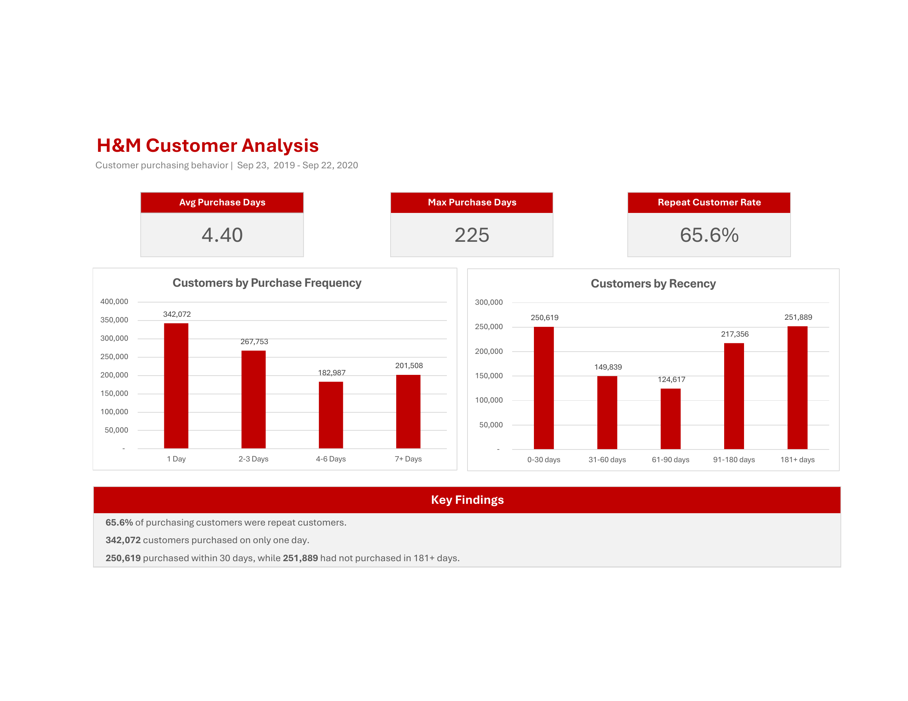
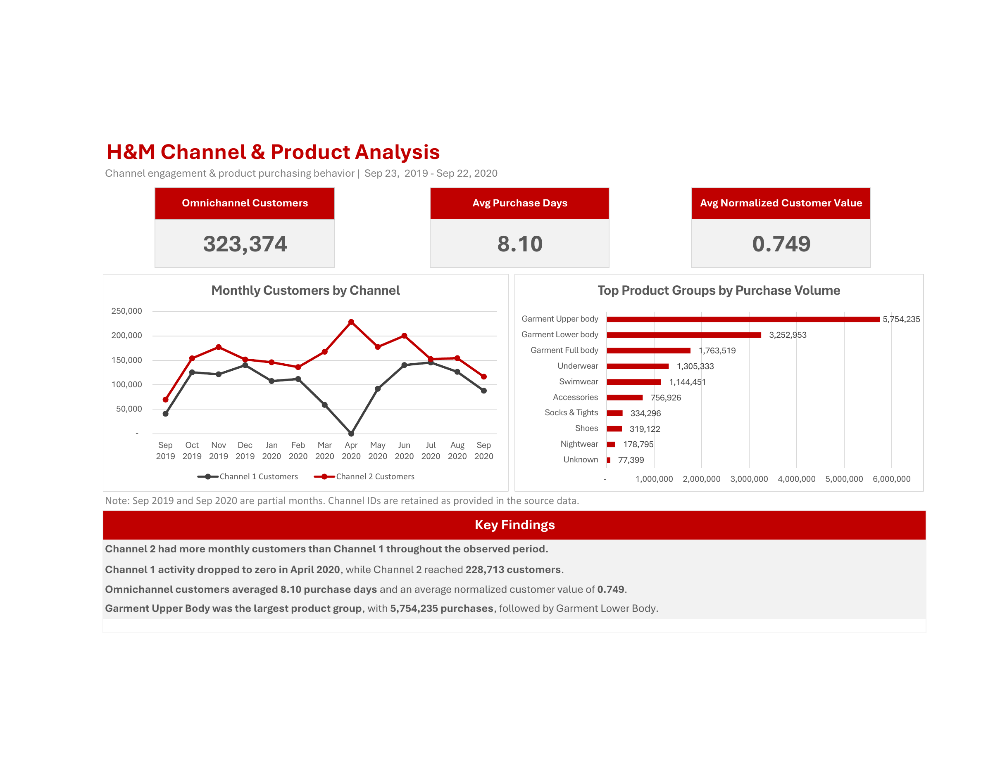
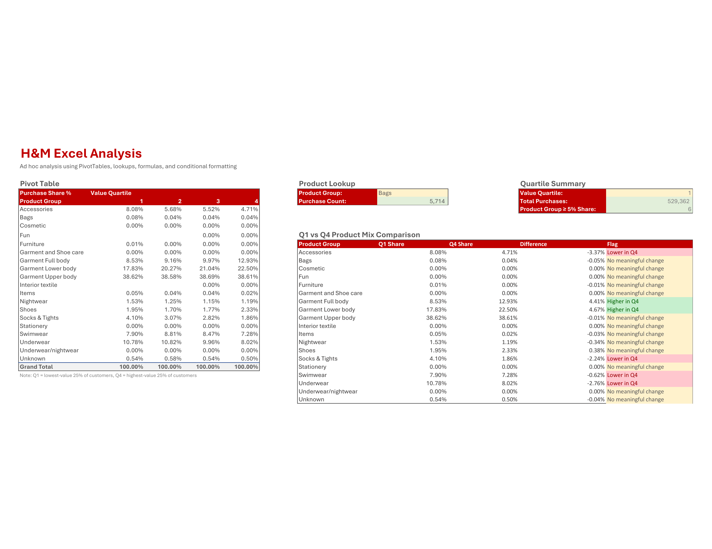
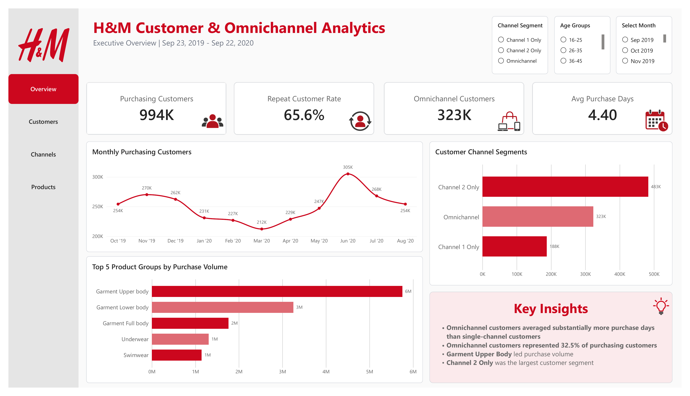
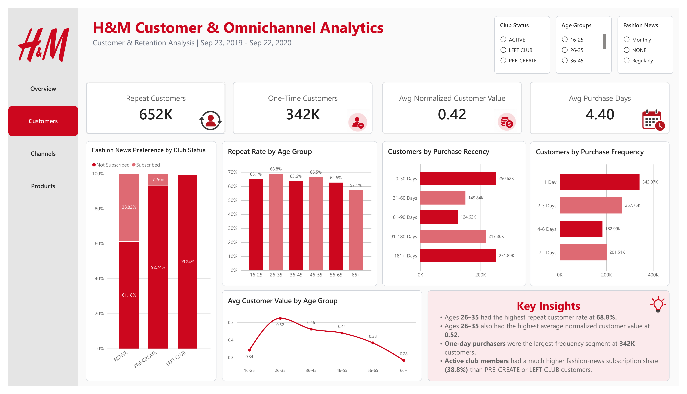
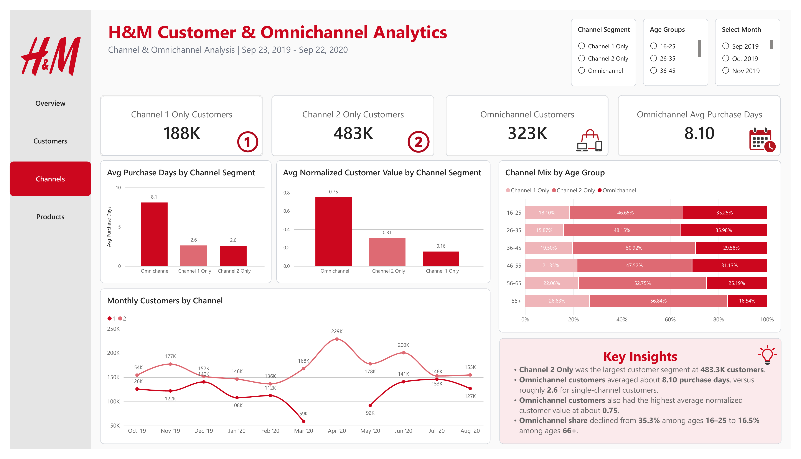
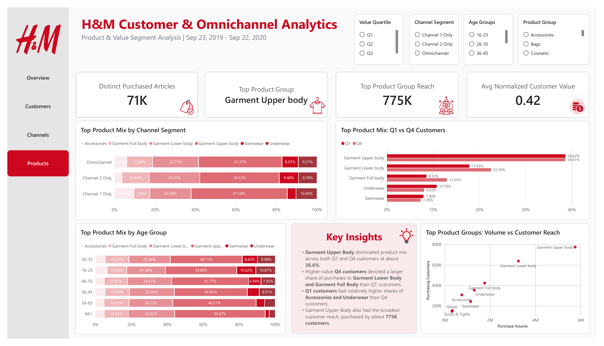

# H&M Customer & Omnichannel Analytics

Customer, channel, and product analytics project using **SQL, Excel, and Power BI** to analyze H&M purchasing behavior, retention, channel usage, customer value, and product performance.

The project uses the public **H&M Personalized Fashion Recommendations** dataset and focuses on a 12-month analysis period from **September 23, 2019 through September 22, 2020**.

**Original dataset:**  
[H&M Personalized Fashion Recommendations — Kaggle](https://www.kaggle.com/competitions/h-and-m-personalized-fashion-recommendations/data)

**Power BI file:**  
[Download the latest `.pbix` from GitHub Releases](https://github.com/kikieliu/hm-customer-insights/releases/latest)

---

## Project Overview

The goal of this project was to recreate a realistic customer and digital analytics workflow by using SQL to prepare and analyze a large transactional dataset, Excel to build business-facing summaries and calculations, and Power BI to create an interactive self-service dashboard.

The analysis focuses on:

- Customer purchasing behavior and retention
- Purchase frequency and recency
- Customer value segmentation
- Channel usage and omnichannel behavior
- Product purchase volume and customer reach
- Product mix across customer segments
- Business reporting and dashboard design

The project emphasizes **SQL, Excel, Power BI, data validation, segmentation, and insight communication** rather than machine learning or recommendation modeling.

---

## Main Findings

- **65.6% of purchasing customers were repeat customers**, making purchases on more than one distinct day.
- **Channel 2 Only was the largest customer segment**, representing 48.6% of purchasing customers.
- **Omnichannel customers showed the strongest engagement**, averaging 8.10 purchase days compared with about 2.6 for single-channel customers.
- Omnichannel customers also had the highest **average normalized customer value at approximately 0.75**.
- **Garment Upper Body was the leading product group**, with approximately 5.75M purchases and a customer reach of 774,997.
- Higher-value **Q4 customers purchased relatively larger shares of Garment Lower Body and Garment Full Body**, while Q1 customers had relatively larger shares of Accessories and Underwear.
- Omnichannel participation generally decreased with age, from about **35.3% among ages 16–25 to 16.5% among ages 66+**.

# Tools Used

### SQL / SQLite

Used for:

- Data preparation
- Data exploration
- Data cleaning
- Data quality validation
- Customer segmentation
- Channel analysis
- Product analysis

### Excel

Used for:

- PivotTables
- XLOOKUP
- SUMIFS
- COUNTIFS
- Nested IF logic
- Linked formulas
- Conditional formatting
- Executive-level reporting

### Power BI

Used for:

- Star-schema data modeling
- DAX measures
- Calculated columns
- Customer segmentation
- Interactive slicers
- KPI cards
- Cross-filtering
- Multi-page dashboard design

---

# Dataset

The original H&M dataset contains three primary files used in this project:

- `transactions_train.csv`
- `customers.csv`
- `articles.csv`

Detailed definitions for the original source columns used in the analysis are available in:

[`documentation/data_dictionary.txt`](documentation/data_dictionary.txt)

## Analysis Scope

The analysis uses transactions from:

**2019-09-23 through 2020-09-22**

Final 12-month analysis scope:

| Metric | Value |
|---|---:|
| Transaction rows | 14,898,423 |
| Purchasing customers | 994,320 |
| Distinct purchased articles | 70,906 |

### Important Dataset Notes

A row in the transaction data represents **one purchased article line item**, not a complete customer order.

The source data does not contain an `order_id`, so transaction row counts are described as **purchase volume**, not order count or basket size.

The `price` field is a **normalized/transformed value** and is therefore not presented as literal currency.

The dataset identifies sales channels only as **Channel 1** and **Channel 2**. This project retains those labels rather than assigning unsupported names such as "online" or "store."

---

# Repository Structure

```text
hm-customer-insights/
│
├── README.md
│
├── data/
│   ├── source/
│   │   ├── articles.csv
│   │   ├── customers_sample.csv
│   │   └── transactions_sample.csv
│   │
│   └── cleaned/
│       └── articles_clean.csv
│
├── documentation/
│   └── data_dictionary.txt
│
├── excel/
│   └── hm_customer_omnichannel_analytics.xlsx
│
├── images/
│   ├── excel_executive_summary.png
│   ├── excel_customer_analysis.png
│   ├── excel_channel_product_analysis.png
│   ├── excel_analysis_tools.png
│   ├── powerbi_overview.png
│   ├── powerbi_customers.png
│   ├── powerbi_channels.png
│   └── powerbi_products.png
│
└── sql/
    ├── 00_data_preparation.sql
    ├── 01_data_exploration.sql
    ├── 02_data_cleaning.sql
    ├── 03_data_quality_checks.sql
    ├── 04_customer_analysis.sql
    ├── 05_channel_analysis.sql
    └── 06_product_analysis.sql
```

The complete original transaction and customer files are not stored in the repository because of their size.

The repository includes smaller sample files where appropriate, while the SQL scripts document the full analysis workflow.

---

# SQL Analysis

## Data Preparation

The transaction dataset was filtered to a 12-month analysis period:

**2019-09-23 through 2020-09-22**

The resulting `transactions_12mo` table contains:

- **14,898,423 transaction rows**
- **994,320 purchasing customers**
- **70,906 distinct purchased articles**

Transaction data was joined to article data for product-level analysis.

---

## Data Quality Checks

Validation included:

- Minimum and maximum transaction dates
- Row counts
- Distinct customer counts
- Distinct article counts
- Null checks
- Duplicate checks
- Product-group validation
- Sales-channel validation

These checks were used throughout the project to confirm that SQL, Excel, and Power BI outputs remained consistent.

---

# Customer Analysis

Customer analysis focused on retention, purchase frequency, recency, age, and normalized customer value.

## Purchase Frequency

Customers were grouped based on their number of distinct purchase days:

| Purchase Frequency Group |
|---|
| 1 Day |
| 2–3 Days |
| 4–6 Days |
| 7+ Days |

Overall:

- **65.6%** of purchasing customers purchased on more than one distinct day.
- Approximately **652K** customers were repeat customers.
- Approximately **342K** customers purchased on only one day.
- Average purchase frequency was **4.40 distinct purchase days per customer**.

---

## Purchase Recency

Recency was calculated using each customer's most recent purchase date relative to the analysis end date of **September 22, 2020**.

Customers were grouped into:

| Recency Group |
|---|
| 0–30 Days |
| 31–60 Days |
| 61–90 Days |
| 91–180 Days |
| 181+ Days |

---

## Age Groups

Customers with known ages were grouped into:

| Age Group |
|---|
| 16–25 |
| 26–35 |
| 36–45 |
| 46–55 |
| 56–65 |
| 66+ |

Customers with missing ages were retained as `Unknown` where appropriate.

---

# Channel Analysis

Customers were classified according to the sales channels they used across the full 12-month analysis period.

Channel segments:

- **Channel 1 Only**
- **Channel 2 Only**
- **Omnichannel**

## Channel Segment Counts

| Channel Segment | Customers | Share of Purchasing Customers |
|---|---:|---:|
| Channel 1 Only | 187,602 | 18.9% |
| Channel 2 Only | 483,344 | 48.6% |
| Omnichannel | 323,374 | 32.5% |

The three channel segments reconcile to the full **994,320 purchasing customers**.

## Purchase Frequency by Channel

| Channel Segment | Avg Purchase Days |
|---|---:|
| Channel 1 Only | ~2.63 |
| Channel 2 Only | ~2.61 |
| Omnichannel | ~8.10 |

Omnichannel customers purchased on substantially more distinct days than single-channel customers.

## Normalized Customer Value by Channel

| Channel Segment | Avg Normalized Customer Value |
|---|---:|
| Channel 1 Only | ~0.16 |
| Channel 2 Only | ~0.31 |
| Omnichannel | ~0.75 |

Omnichannel customers represented approximately one-third of purchasing customers while showing the highest purchase frequency and average normalized customer value.

---

# Product Analysis

Product analysis evaluates both **purchase volume** and **customer reach**.

## Top Product Groups by Purchase Volume

| Product Group | Purchase Volume |
|---|---:|
| Garment Upper body | ~5.75M |
| Garment Lower body | ~3.25M |
| Garment Full body | ~1.76M |
| Underwear | ~1.31M |
| Swimwear | ~1.14M |

Purchase volume represents the number of purchased article line items.

---

## Product Group Customer Reach

Customer reach represents the number of **distinct customers** who purchased at least one article from a product group.

| Product Group | Customer Reach |
|---|---:|
| Garment Upper body | 774,997 |
| Garment Lower body | 638,249 |
| Garment Full body | 422,889 |
| Underwear | 354,666 |
| Accessories | 308,378 |
| Swimwear | 243,695 |

Garment Upper Body had both the highest purchase volume and the broadest customer reach.

---

# Customer Value Segmentation

Customers were ranked using their total normalized purchase value across the analysis period and divided into four value segments:

| Quartile | Definition |
|---|---|
| Q1 | Lowest-value customers |
| Q2 | Lower-middle value |
| Q3 | Upper-middle value |
| Q4 | Highest-value customers |

Product mix was then compared across value segments.

## Q1 vs Q4 Product Mix

| Product Group | Q1 | Q4 |
|---|---:|---:|
| Garment Upper body | 38.62% | 38.61% |
| Garment Lower body | 17.83% | 22.50% |
| Garment Full body | 8.53% | 12.93% |
| Underwear | 10.78% | 8.02% |
| Accessories | 8.08% | 4.71% |
| Swimwear | 7.90% | 7.28% |

Garment Upper Body represented approximately the same share for both Q1 and Q4 customers.

Higher-value Q4 customers had relatively larger shares of:

- Garment Lower Body
- Garment Full Body

Q1 customers had relatively larger shares of:

- Accessories
- Underwear

These relationships are descriptive and should not be interpreted as causal effects.

---

# Excel Analysis

The Excel workbook adds a business-reporting layer using formulas, PivotTables, conditional formatting, and summary dashboards.

Workbook:

[`excel/hm_customer_omnichannel_analytics.xlsx`](excel/hm_customer_omnichannel_analytics.xlsx)

The workbook contains:

- `01 Executive Summary`
- `02 Customer Analysis`
- `03 Channel & Product Analysis`
- `04 Excel Analysis`
- `Data_Customer`
- `Data_Channel`
- `Data_Product`

---

## Excel Executive Summary

The Executive Summary highlights:

- Purchasing Customers
- Average Purchase Days
- Repeat Customer Rate
- Omnichannel Customers
- Customer Channel Segments
- Top Product Groups by Purchase Volume
- Key findings



---

## Excel Customer Analysis

The Customer Analysis worksheet explores customer behavior including purchase frequency, retention, recency, and segmentation.



---

## Excel Channel & Product Analysis

This worksheet compares customer behavior across channel segments and summarizes product performance.



---

## Excel Analysis Tools

The Excel Analysis worksheet demonstrates commonly used analyst functions and reporting techniques.

### Product Lookup

Uses `XLOOKUP` to return purchase volume for a selected product group.

### Quartile Summary

Uses `SUMIFS` and `COUNTIFS` to summarize purchase behavior for selected customer-value quartiles.

### Q1 vs Q4 Product Mix Comparison

Compares Q1 and Q4 product-mix percentages and uses conditional formatting to highlight meaningful differences.



---

# Power BI Dashboard

The Power BI report contains four interactive pages:

1. **Executive Overview**
2. **Customer & Retention Analysis**
3. **Channel & Omnichannel Analysis**
4. **Product & Value Segment Analysis**

The complete `.pbix` file is stored separately as a **GitHub Release asset** because its size exceeds GitHub's standard repository file-size limit.

**Download Power BI report:**  
[Latest GitHub Release](https://github.com/kikieliu/hm-customer-insights/releases/latest)

---

# Power BI Data Model

Power BI uses a star-schema-style model with `transactions_12mo` as the central fact table.

```text
                    customers_clean
                          |
                        1 : *
                          |
                          v
                    transactions_12mo
                          ^
                          |
                        * : 1
                          |
                     articles_clean
```

The relationships are:

```text
customers_clean[customer_id]
        1
        |
        *
transactions_12mo[customer_id]
```

```text
articles_clean[article_id]
        1
        |
        *
transactions_12mo[article_id]
```

Relationships are active and use single-direction filtering from the dimension tables into the transaction fact table.

---

# Power BI Date Table

A separate Date dimension was created directly inside Power BI.

It is **not an original dataset file** and is therefore not included in `documentation/data_dictionary.txt`.

The Date table contains one row for every calendar date within the analysis period and is connected to:

```text
Date[Date]
    1
    |
    *
transactions_12mo[t_dat]
```

The table includes:

- `Date`
- `Year`
- `Month Name`
- `Month Number`
- `Year-Month`
- `Year-Month Sort`
- `Month-Year Short`

`Month Name` is sorted using `Month Number`.

`Year-Month` is sorted using `Year-Month Sort` to prevent alphabetical month ordering.

`Month-Year Short` creates compact labels such as:

```text
Oct '19
Nov '19
Dec '19
Jan '20
```

The table is also marked as the official Date table in Power BI.

September 2019 and September 2020 contain only partial-month data.

Those records remain part of the full 12-month analysis, but the two partial September months are excluded from selected monthly trend visuals where full-month comparisons are more appropriate.

---

# Power BI — Executive Overview

The Executive Overview provides a high-level summary of customer activity.

### KPIs

- Purchasing Customers — **994K**
- Repeat Customer Rate — **65.6%**
- Omnichannel Customers — **323K**
- Avg Purchase Days — **4.40**

### Visuals

- Monthly Purchasing Customers
- Customer Channel Segments
- Top 5 Product Groups by Purchase Volume
- Key Insights

### Filters

- Age Group
- Channel Segment
- Month



---

# Power BI — Customer & Retention Analysis

This page focuses on customer purchasing behavior and retention.

### KPIs

- Repeat Customers — **652K**
- One-Time Customers — **342K**
- Avg Normalized Customer Value — **0.42**
- Avg Purchase Days — **4.40**

### Visuals

- Customers by Purchase Frequency
- Customers by Purchase Recency
- Repeat Rate by Age Group
- Avg Customer Value by Age Group
- Fashion News Preference by Club Status
- Key Insights

### Filters

- Age Group
- Club Status
- Fashion News



---

# Power BI — Channel & Omnichannel Analysis

This page compares customer behavior across Channel 1, Channel 2, and Omnichannel segments.

### KPIs

- Channel 1 Only Customers — **188K**
- Channel 2 Only Customers — **483K**
- Omnichannel Customers — **323K**
- Omnichannel Avg Purchase Days — **8.10**

### Visuals

- Monthly Customers by Channel
- Avg Purchase Days by Channel Segment
- Channel Mix by Age Group
- Avg Normalized Customer Value by Channel Segment
- Key Insights

### Filters

- Age Group
- Channel Segment
- Month

One notable pattern was the decline in omnichannel share across age groups:

- Ages 16–25 — approximately **35.3% Omnichannel**
- Ages 66+ — approximately **16.5% Omnichannel**



---

# Power BI — Product & Value Segment Analysis

This page focuses on product performance and customer-value segmentation.

### KPIs

- Distinct Purchased Articles — **71K**
- Top Product Group — **Garment Upper body**
- Top Product Group Reach — **775K**
- Avg Normalized Customer Value — **0.42**

### Visuals

- Top Product Groups: Volume vs Customer Reach
- Q1 vs Q4 Product Mix
- Product Mix by Channel Segment
- Product Mix by Age Group
- Key Insights

### Filters

- Product Group
- Value Quartile
- Channel Segment
- Age Group



---

# Key Findings

### Customer Retention

**65.6%** of purchasing customers made purchases on more than one distinct day.

Approximately **342K customers** purchased on only one day, while approximately **652K** were repeat customers.

### Channel Behavior

**Channel 2 Only** was the largest customer segment, representing approximately **48.6%** of purchasing customers.

**Omnichannel customers** represented approximately **32.5%** of purchasing customers but averaged about **8.10 purchase days**, compared with approximately **2.6 days** for single-channel customers.

Omnichannel customers also had the highest average normalized customer value at approximately **0.75**.

### Product Performance

**Garment Upper Body** was the highest-volume product group and reached **774,997 distinct customers**.

### Customer Value

Higher-value **Q4 customers** had relatively larger shares of Garment Lower Body and Garment Full Body purchases than Q1 customers.

Q1 customers had relatively larger shares of Accessories and Underwear.

### Age & Channel Behavior

Omnichannel share generally declined with age, from approximately **35.3% among ages 16–25** to approximately **16.5% among customers age 66+**.

---

# Limitations

- September 2019 and September 2020 contain partial-month data.
- Partial months remain in full-period KPIs but are excluded from selected monthly trend visuals.
- The source dataset does not contain an `order_id`.
- Transaction rows therefore cannot be interpreted as complete customer orders.
- The `price` field is normalized and is not presented as literal currency.
- Channel IDs are retained as Channel 1 and Channel 2 because the source dataset does not provide an official store/online mapping.
- Customer-level segments such as Channel Segment and Value Quartile are based on behavior across the full analysis period.
- Some 100% stacked Power BI visuals display only leading product groups for readability. Percentages in those visuals represent the mix among the displayed product groups when Top-N filtering is applied.

---

# Reproducing the Analysis

The SQL scripts are organized in execution order:

```text
00_data_preparation.sql
01_data_exploration.sql
02_data_cleaning.sql
03_data_quality_checks.sql
04_customer_analysis.sql
05_channel_analysis.sql
06_product_analysis.sql
```

The scripts document:

- Data preparation
- Analysis-period filtering
- Data-quality validation
- Customer segmentation
- Retention analysis
- Channel segmentation
- Product performance
- Customer reach
- Customer-value segmentation
- Product-mix comparisons

Because the complete source transaction dataset is very large, it is not stored directly in this repository.

The original data can be downloaded from:

[H&M Personalized Fashion Recommendations — Kaggle](https://www.kaggle.com/competitions/h-and-m-personalized-fashion-recommendations/data)

---

# Power BI File

The complete Power BI `.pbix` file is available through the repository's **GitHub Releases** section.

[Download the latest Power BI release](https://github.com/kikieliu/hm-customer-insights/releases/latest)

The report is distributed through GitHub Releases instead of the normal repository because the `.pbix` exceeds GitHub's standard file-size limit.
